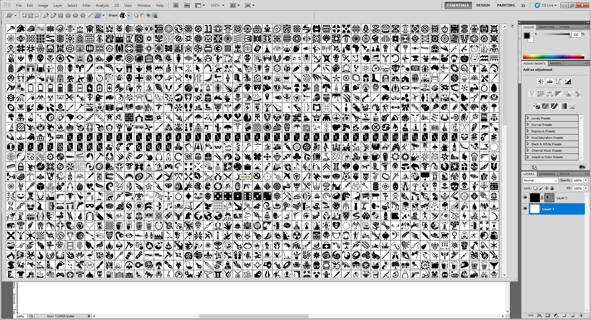

# game-icons

I want to get ".csh" file from http://game-icons.net/ so I could use all shapes in photoshop. 

[Download .csh file from 8. March 2018](https://github.com/EntityB/game-icons/raw/master/port/game-icons-3209.csh)
So I did following:

1. I downloaded SVG format with transparent background and black foreground. 
2. I moved all icons to one folder for easier manipulation, with command

```bash
    find icons '*.svg' -exec cp -vuni '{}' "/abspath_to/icons2" ";"
```

3. I uploaded all icons to https://icomoon.io/app online app. I had to do it step by step, because it was not possible to upload such an amount of files at once. 
4. I selected all the icons and downloaded it and also selected CSH file export. 
5. I put CSH file into Photoshop. 

Here is a preview of all 3209 shapes I exported:
[](https://github.com/EntityB/game-icons/raw/master/doc/preview.jpg)
